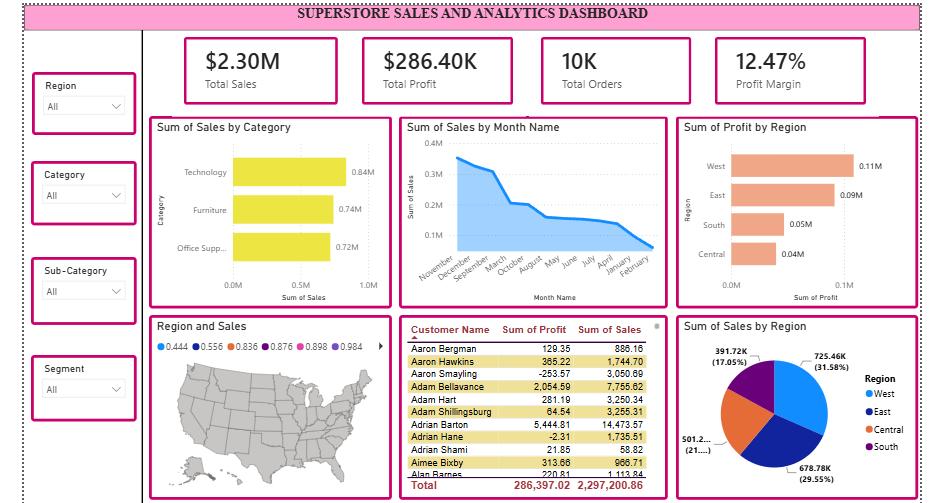

#  Superstore Sales Analytics | Power BI + Microsoft Fabric + AI Insights

##  Overview

This project showcases an end-to-end Business Intelligence solution using **Power BI**, **Microsoft Fabric**, and **AI-powered insights** to analyze the Superstore dataset. The project transforms raw sales data into meaningful business insights through data visualization, cloud-based data management, and AI-driven analytics.

---

##  Tools Used

- Microsoft Power BI
- Microsoft Fabric
- Power Query
- DAX (Data Analysis Expressions)
- AI Visuals (Key Influencers & Smart Narrative)
- Superstore Dataset

---

#  Project Phases

##  Phase 1 – Power BI Dashboard Development

- Imported and cleaned the Superstore dataset.
- Performed data transformation using Power Query.
- Created calculated columns and DAX measures.
- Built interactive dashboards with:
  - KPI Cards
  - Sales by Category
  - Sales by Region
  - Sales by Segment
  - Monthly Sales Trend
  - Profit by Category
  - Profit by Region
  - Monthly Profit Trend
- Added interactive slicers for Region, Category, and Year.

---

##  Phase 2 – Microsoft Fabric Implementation

- Created a Microsoft Fabric Workspace.
- Built a Lakehouse and uploaded the Superstore dataset.
- Loaded data into Delta Tables.
- Created a Semantic Model for reporting.
- Managed data transformation and modeling within Microsoft Fabric.
- Published reports and dashboards to the Fabric Workspace.

---

##  Phase 3 – AI Insights

Implemented Power BI AI features to generate intelligent business insights.

### AI Visuals Used

- Key Influencers
- Smart Narrative

### AI Findings

- Identified the key factors influencing profit.
- Analyzed the relationship between Sales and Discounts.
- Generated automated summaries of sales performance.
- Enabled AI-driven business decision support.

---

#  Dashboard Metrics

| Metric | Value |
|---------|--------|
| Total Sales | $2.30M |
| Total Profit | $286.40K |
| Total Orders | 9,994 |
| Profit Margin | 12% |

---

#  Key Insights

- Technology generated the highest sales and overall profit.
- Consumer customers contributed the highest share of total sales.
- The West region recorded the highest profit among all regions.
- November achieved the highest monthly sales performance.
- Furniture showed lower profitability compared to other product categories.
- AI Key Influencers revealed that higher sales and lower discounts positively impact profit.

---

#  Dashboard Preview

### Power BI Dashboard

  
### Microsoft Fabric Dashboard

* Fabic Dashboard(Power BI Dashboard.png)*

### AI Insights Dashboard

* AI Insights(Page 2)*

